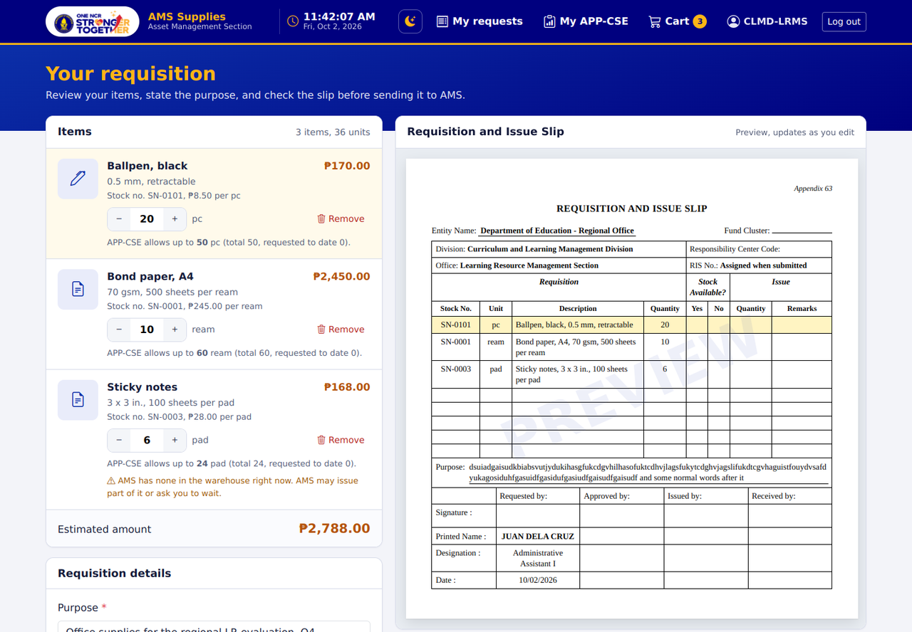
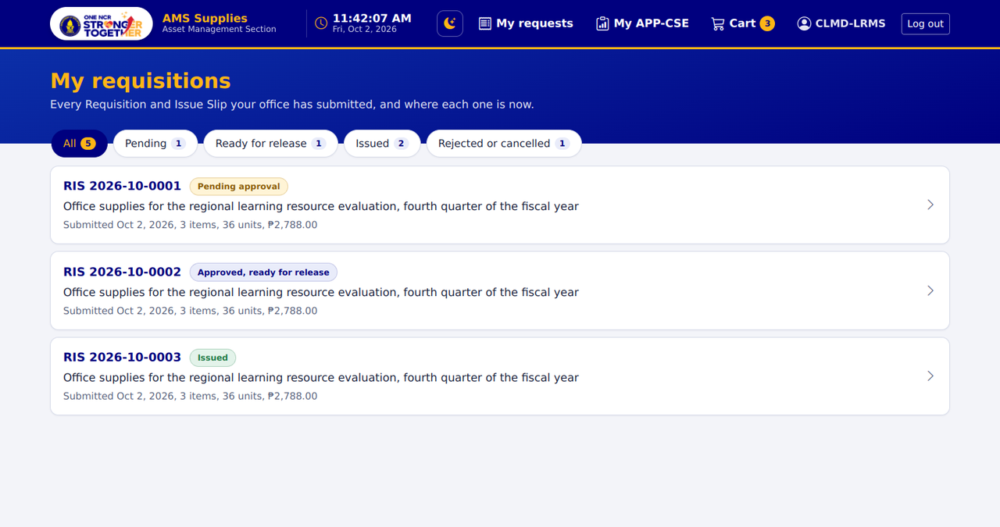
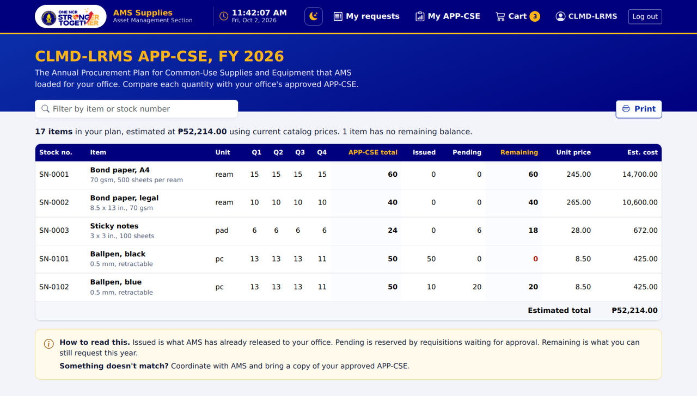
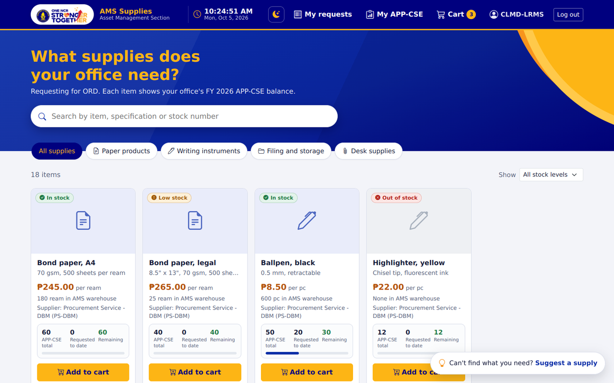
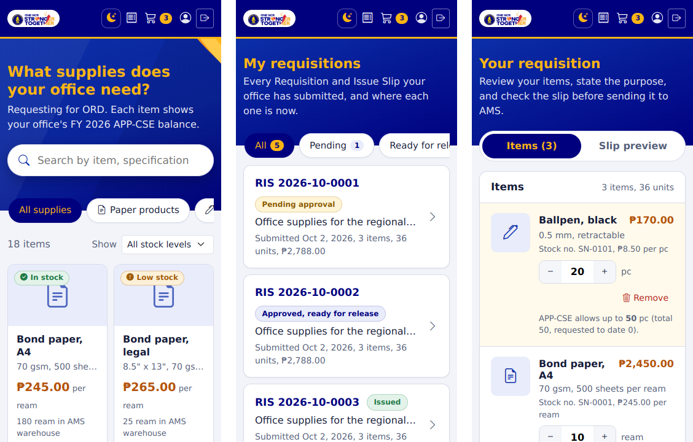
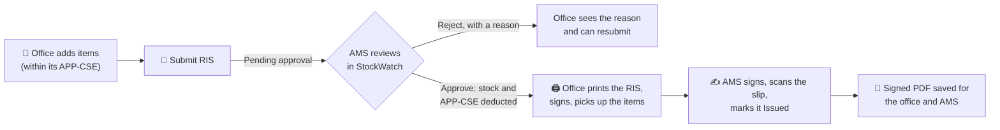

<p align="center">
  
</p>

<p align="center">
  
  
  
  
  
  
</p>

<p align="center">
  <b>Shop-style ordering portal for the 22 offices of the DepEd NCR Regional Office.</b><br>
  Offices browse what the Asset Management Section (AMS) has in stock, request it within their APP-CSE,
  and follow every Requisition and Issue Slip (RIS, Appendix 63) until the items are issued.
</p>

<p align="center">
  <a href="https://assetshop.runasp.net">Live site</a> ·
  <a href="https://github.com/Oshinobi-obi/AMS_Storage_and_Report_System">AMS StockWatch (admin side)</a> ·
  <a href="#getting-started">Run it locally</a>
</p>

---

## What offices can do

| | |
|---|---|
| **Browse the catalog** | Photos, prices, specifications and colour-coded warehouse stock: 🟢 in stock, 🟡 low, 🔴 out. Guests can browse; offices log in to request. |
| **Stay within the APP-CSE** | Every item shows the office's *APP-CSE total · requested to date · remaining*. The system refuses anything over the balance, with a clear explanation. |
| **Cart → RIS in one view** | The cart fills in a live preview of the official **Appendix 63** slip: entity, division, office, items, purpose and signatories. |
| **Submit with confidence** | A confirmation shows the full summary first. Quantities are reserved from the APP-CSE while AMS reviews. |
| **Follow every request** | *Submitted → Approved → Print, sign and pick up → Issued*. Choose who will receive the items, print the complete slip for signing, or cancel while it's still pending. |
| **Signed copy on file** | Once AMS issues the items, the **wet-signed RIS (PDF)** appears on the request for good. |
| **My APP-CSE** | The office's whole plan per quarter, with issued, pending and remaining, ready to print and check against the signed APP-CSE. |
| **Suggest a supply** | A floating button for items AMS doesn't carry yet. |

**Also:** live updates with no refreshing, notification sounds, desktop notifications, light and dark mode, a live Philippine-time clock, and layouts that work on phones from 320 px up to large monitors.

## Screenshots

<p align="center">
  
</p>

<table>
  <tr>
    <td width="50%"><br><sub><b>Cart and RIS preview:</b> the slip fills in as you edit.</sub></td>
    <td width="50%"><br><sub><b>My requisitions:</b> every RIS and where it is now.</sub></td>
  </tr>
  <tr>
    <td width="50%"><br><sub><b>My APP-CSE:</b> allocation, issued, pending and remaining.</sub></td>
    <td width="50%">
      <picture>
        <source media="(prefers-color-scheme: dark)" srcset="docs/screenshots/catalog-dark.png">
        
      </picture><br><sub><b>Catalog:</b> follows your GitHub light/dark theme.</sub>
    </td>
  </tr>
</table>

<p align="center">
  <br>
  <sub>The same pages on a 360 px phone.</sub>
</p>

<sub>Screenshots show sample data.</sub>

## How a requisition moves



Both websites share one MySQL database. A background watcher on each server notices status changes within about five seconds and updates every open page, with a sound for *approved*, *rejected* and *issued*.

## Tech stack

| Layer | Used |
|---|---|
| Web app | ASP.NET Core **.NET 10**, Blazor Web App (**Interactive Server**, SignalR) |
| Data | **MySQL 8.0.16+**, Entity Framework Core 9 with Pomelo, `IDbContextFactory` per operation |
| Sign-in | Cookie authentication, **bcrypt** (cost 12), antiforgery, per-IP rate limit, account lockout |
| UI | Bootstrap 5.3, Bootstrap Icons, custom DepEd NCR design system, no JavaScript framework |
| Files | Signed RIS PDFs and item photos stored **in the database**, so both sites can read them |
| Hosting | IIS (MonsterASP.NET), HTTPS |

## Project structure

```text
AMS_Shopee/
├─ Components/
│  ├─ Account/        LoginForm (modal)
│  ├─ Catalog/        ItemCard, ItemDetail
│  ├─ Layout/         MainLayout, TopBar, LiveNotifier, PasswordGuard
│  ├─ Pages/          Home (catalog), Cart, MyRequisitions, MyRequisition, MyAppCse, ChangePassword
│  ├─ Requisition/    RisDocument (Appendix 63 layout)
│  ├─ Shared/         Modals, PersonnelPicker, StockBadge, QuotaMeter, ThemeToggle, PhClock, ToastHost
│  └─ Suggestions/    Suggest-a-supply button and form
├─ Data/              AmsDbContext + entities (scaffolded)
├─ Database/          000 → 006 SQL scripts (run in order)
├─ Endpoints/         Sign-in / out, signed RIS PDF, item photos
├─ Services/          Requisition rules, catalog, live updates, session security, UI state
└─ wwwroot/           app.css, css/ris.css, js/, sounds/, images/
```

## Getting started

### 1. Requirements
* [.NET 10 SDK](https://dotnet.microsoft.com/download)
* MySQL **8.0.16 or newer** (CHECK constraints are used)
* Visual Studio 2022+ or VS Code

### 2. Database
Create an empty database (e.g. `ams_stockwatch`), then run the scripts in **`Database/`** in order:

| Script | What it does |
|---|---|
| `000_base_schema.sql` | **New databases only.** Users, offices, personnel, property tables, and a starter Super Admin |
| `001_requisition_portal.sql` | Catalog, APP-CSE, cart, RIS, stock ledger, suggestions, the 22 offices |
| `002_sample_data.sql` | *Optional, for testing only.* Sample items, APP-CSE and office logins |
| `003_default_approver.sql` → `006_item_images.sql` | Default signatories, RIS header, signed copies, item photos |

> [!TIP]
> On shared hosting (phpMyAdmin), select your database first and remove any `USE ams_stockwatch;` line before running a script.

### 3. Connection string (never in Git)
```bash
cd AMS_Shopee
dotnet user-secrets set "ConnectionStrings:Default" "server=localhost;port=3306;database=ams_stockwatch;user=YOUR_USER;password=YOUR_PASSWORD;"
```

### 4. Run
```bash
dotnet run
```
Office accounts are created by AMS in **AMS StockWatch → Accounts**. Each one must choose its own password at its first sign-in.

## Configuration

| Setting | Where | Purpose |
|---|---|---|
| `ConnectionStrings:Default` | User Secrets (dev) / `appsettings.Production.json` (server) | MySQL connection |
| `https_port` | `appsettings.Production.json` | Redirects `http://` visitors to HTTPS (usually `443`) |
| `Auth:AllowHttpCookies` | `appsettings.Production.json` | **Temporary** switch for a server without SSL. Keep it off |
| Entity Name, Fund Cluster, signatories | AMS StockWatch → **Settings** | Printed on every RIS |

`appsettings.Production.json`, `App_Data/`, logs and database dumps are excluded by `.gitignore`.

## Deployment (MonsterASP.NET)
1. Run the database scripts on the hosted database.
2. Create `appsettings.Production.json` with the hosted connection string and `"https_port": 443`.
3. Publish with the site's Web Deploy profile, turn on **SSL / Force HTTPS** in the control panel, then restart the site.

## Security at a glance
* Every SQL statement is parameterized (EF Core, `ExecuteSqlInterpolated`), so text typed into the site can't change a query.
* Passwords are stored with bcrypt; 5 wrong tries lock an account for 15 minutes; at most 40 sign-in attempts per IP every 5 minutes.
* Sessions are re-checked every 5 minutes: deactivated accounts and changed passwords are signed out.
* HTTPS-only cookies, security headers, offices can only open their own requisitions and PDFs.

## Related
* **[AMS StockWatch](https://github.com/Oshinobi-obi/AMS_Storage_and_Report_System)**, the admin side: approvals, inventory, catalog, APP-CSE upload, reports.

---

<p align="center">
  <sub>Built for the <b>Asset Management Section, DepEd NCR</b> by <a href="https://github.com/Oshinobi-obi">Oshinobi</a>. For internal use of the Regional Office.</sub>
</p>
